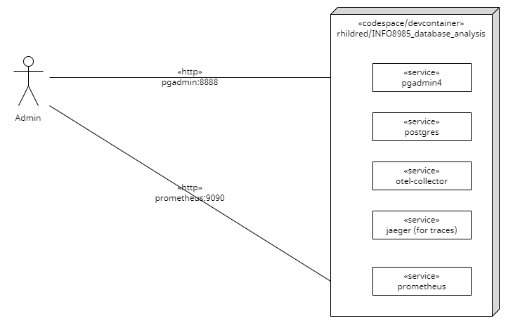
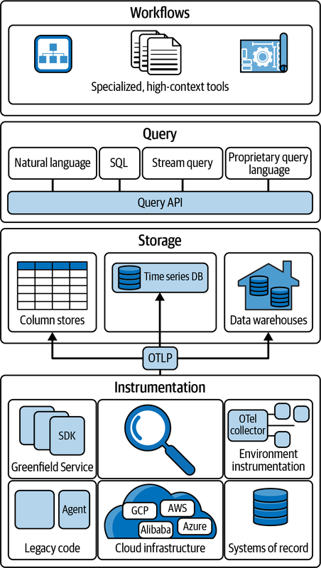
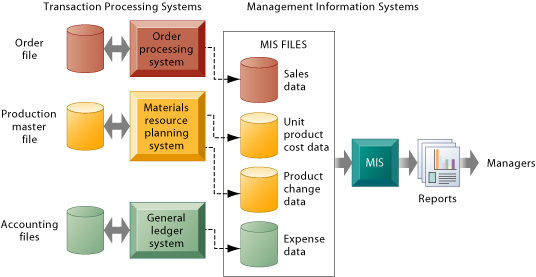

## Agenda

- More from last week's lesson on collecting
- Introduce the Challenge/Activity
- Theory to support learning outcomes and the Activity
- Initial demo of activity

## More Complete Example



## Bounty for Kubernetes

- notice that I have used docker-compose for this
- couldn't get the otel-collector to send metrics to prometheus
- would be very interested if you could compare templates/otel-collector-cm0-configmap.yaml to the opentelemetry demo values.yaml and get it working.

## Database Analysis Challenge

Create a codespace from this [github template](`r rmarkdown::metadata$lab`). 

- Use the pg_stat_database table to receive RED metrics.
- test with pgadmin
- you can trigger a rollback/error by making a syntax error in your sql
- submit the otel-collector yaml that logs RED metrics


## Unit Learning Objectives

- Measure baseline metrics for the database of a system.
- Select thresholds for logging long running queries.
- Infer causes of system issues by finding exceptions from baseline behaviour and drawing correlation to logs and other database events.
- Justify metric thresholds for generating alerts so that they can be responded to appropriately.
- Support management overview of data running through the system by generating daily reports.

## Many sources of Observability



## Baseline metrics

- REDS is a good start
- for instance to get total number of transactions

```SQL
SELECT sum(xact_commit+xact_rollback) FROM pg_stat_database;
```

- read more at https://signoz.io/blog/postgresql-monitoring/

## Errors

```SQL
SELECT sum(xact_rollback) FROM pg_stat_database;
```

 - for testing you can trigger a rollback by making a SQL error like `SELECT * FROM pg_stats_database`
 - you can also try out the pg_stat_database queries in pgadmin

## Duration

```SQL
SELECT SUM(active_time) FROM pg_stat_database;
```

- the average duration is this, divided by the number of requests

## Saturation

- ran out of time to get the Saturation
- thinking that this could be obtained from kubernetes or docker by looking at %cpu for the postgres service


## Long running queries

- a query is a problem when the request rate is greater than the duration 
- if it takes 2 seconds to run a query and the average request rate is 2 per minute, there is no problem
- if the request rate is greater than 30 per minute there is a big problem

## To find long running queries

```SQL
SELECT pid, now() - pg_stat_activity.query_start AS duration, query 
FROM pg_stat_activity 
WHERE (now() - pg_stat_activity.query_start) > interval '2 minutes';
```

## Log rather than metric

```yaml
    queries:
    - sql: <from above>
      logs:
      - structured_body: true

```

## User problems ...

- can sometimes be traced back to database problems
- the system becoming bogged down can be caused by duration > arrival rate and fixed by adding 
- exceptions from database logs can relate to gateway timeouts from unhandled exceptions in the

## Alerts can be generated

... when metrics collected from pg_stat??? are out of range

- read more in https://prometheus.io/docs/alerting/latest/overview/

## Reporting for management

- management is driven by metrics too
- Key performance indicators relate to business goals/ effectiveness
- Metrics track the status of business processes
- a SMART KPI is Specific, Measurable, Achievable, Relevant, and Time-bound

## Metrics from the system of record



## Collecting from the database

- produce systems information to meet the needs of different stakeholders
- this week for the lab follow the given links looking especially at SQL queries for different stakeholders

