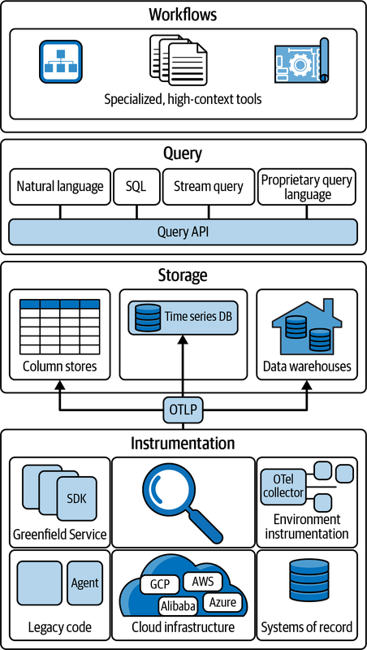
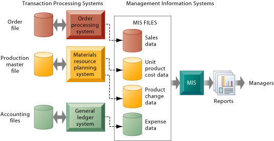

## Agenda

- Review last week's lesson on Telemetry
- Introduce the Challenge/Activity
- Theory to support learning outcomes and the Activity
- Initial demo of activity

Based on The New Observability model (end of chapter 4)

## Finding Needles in Haystacks


## Probably a bit more complex

... than what you will see at work

- more languages 
- each service has a single responsibilty
- microservices and microfrontends allow autonomus teams

## Database Observability Challenge

Create a codespace from this [github template](`r rmarkdown::metadata$lab`). Use the [article at](https://opentelemetry.io/blog/2024/getting-started-with-otelsql/) to instrument. If this ends up a struggle try to understand the `runSQLQuery` part with the theory about the system of record.

## Unit Learning Objectives

- Measure baseline metrics for the database of a system.
- Select thresholds for logging long running queries.
- Infer causes of system issues by finding exceptions from baseline behaviour and drawing correlation to logs and other database events.
- Justify metric thresholds for generating alerts so that they can be responded to appropriately.
- Support management overview of data running through the system by generating daily reports.

## Many sources of Observability



## Baseline metrics

- REDS is a good start
- for instance to get total number of transactions

```SQL
SELECT sum(xact_commit+xact_rollback) FROM pg_stat_database;
```

- read more at https://signoz.io/blog/postgresql-monitoring/

## Long running queries

- a query is a problem when the request rate is greater than the duration 
- if it takes 2 seconds to run a query and the average request rate is 2 per minute, there is no problem
- if the request rate is greater than 30 per minute there is a big problem

```SQL
SELECT pid, now() - pg_stat_activity.query_start AS duration, query 
FROM pg_stat_activity 
WHERE (now() - pg_stat_activity.query_start) > interval '2 minutes';
```

## User problems ...

- can sometimes be traced back to database problems
- the system becoming bogged down can be caused by duration > arrival rate and fixed by adding 
- exceptions from database logs can relate to gateway timeouts from unhandled exceptions in the

## Alerts can be generated

... when metrics collected from pg_stat??? are out of range

- read more in https://prometheus.io/docs/alerting/latest/overview/

## Reporting for management

- management is driven by metrics too
- Key performance indicators relate to business goals/ effectiveness
- Metrics track the status of business processes
- a SMART KPI is Specific, Measurable, Achievable, Relevant, and Time-bound

## Metrics from the system of record



## Collecting from the database

- produce systems information to meet the needs of different stakeholders
- this week for the lab follow the given links looking especially at SQL queries for different stakeholders

