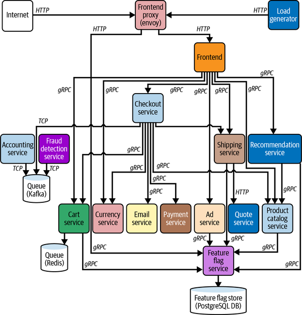

## Agenda

- Review last week's lesson on Telemetry
- Introduce the Challenge/Activity
- Theory to support learning outcomes and the Activity
- Initial demo of activity

Based on The New Observability model (end of chapter 4)

## Finding Needles in Haystacks

## Probably a bit more complex

... than what you will see at work

- more languages 
- each service has a single responsibilty
- microservices and microfrontends allow autonomus teams

## Database Observability Challenge

Create a codespace from this [github template](`r rmarkdown::metadata$lab`). Use the [article at](https://opentelemetry.io/blog/2024/getting-started-with-otelsql/) to instrument. If this ends up a struggle try to understand the `runSQLQuery` part with the theory about the system of record.

