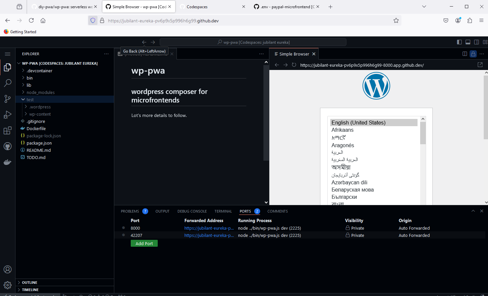
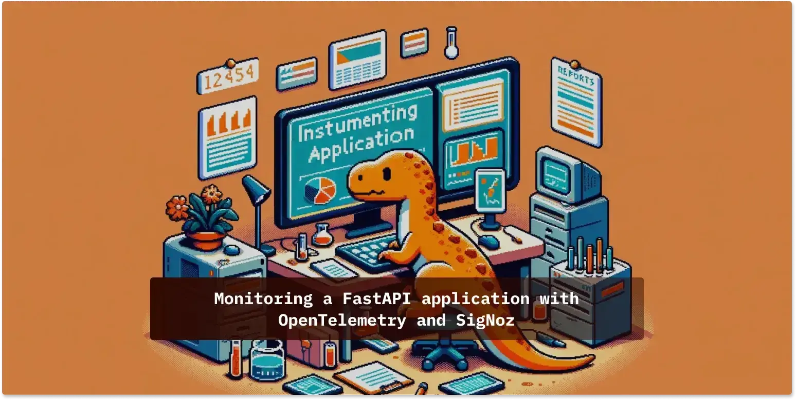

## Agenda

- Review [Analysis with signoz and fastapi](https://github.com/rhildred/INFO8985_microservice_analysis)
- Look at [javascript otel](https://github.com/rhildred/node-otel)
- Microfrontend talk
- Initial demo of activity

## Learning Outcomes

- Interpret information from logs to reproduce and resolve problems.
- Measure REDS metrics in a microservice by adding and incrementing the appropriate counters.
- Determine metrics from the point of view of the customer from a micro-frontend

## Analysis with signoz and fastapi

- today's microfrontend is based on [fastapi as on last week](https://github.com/rhildred/INFO8985_microservice_analysis)
- Hopefully you are comfortable with viewing metrics, logs and traces in signoz
- the app last week was in the /app folder
- this week the app is `/app.py`
- please instrument it and run as in the other lab once you are comfortable with what it does.

## Instrumenting front end code

- while preparing, I did this [javascript example](https://github.com/rhildred/node-otel).
- this is based on a [javascript example](https://signoz.io/opentelemetry/nodejs/).
- the javascript code for this project is in `/index.js`
- please instrument it and run as in the other lab once you are comfortable with what it does.

## Microfrontends

- for autonomous teams to develop software that can then be composed in to an application
- reduce coupling!
- Martin Fowler wrote about this is [this excellent article](https://martinfowler.com/articles/micro-frontends.html)
- the holy grail of distributed systems
- not as well adopted as one would hope for

## Composition

- micro frontends have custom elements for their autonomous user interfaces
- a custom element extends a HTMLElement to implement a particular new tag

```javascript
class Year extends HTMLElement {
    connectedCallback() {
        this.innerHTML = new Date().getFullYear();
    }
}
```

## The custom element is pulled in by
```javascript
customElements.define("x-date", Year);
```

and

```html
<script src="index.js" type="module"></script>
```

## The script brings the custom tag in anywhere



## Even into legacy apps

- retrieve with wget -r
- build with figma and TeleportHQ
- or with something like Rails, Django or Symphony

## Monitoring and Logging

- so important with autonomous teams
- the devOps group may be the only ones who see the whole application
- important to get the repository path as the service.name
- very important to get the commit hash
- monitoring and logging can take away some of the passion about what code belongs to which autonomous team

## The article last week

[](https://signoz.io/blog/opentelemetry-fastapi/)

## Correlating Traces Across Microservices

- also important with Microfrontends
```python
from opentelemetry.propagate import extract, inject
ctx = extract(request.headers)
    with tracer.start_as_current_span("get_user", context=ctx):
        inject(headers)
```

## strace

- traces system calls of a particular process
- with autonomous teams and microfrontends we need to trace across processes
- opentelemetry lets us do that in a way that we can really add value beyond predictability to our companies

## This week's activity

- to instrument the [code in the lab](`r rmarkdown::metadata$lab`).
- add signoz to your project like in [last week's lab](https://github.com/rhildred/INFO8985_microservice_analysis)
- you do not need to worry about logging on the [javascript side](https://github.com/rhildred/node-otel)
- that's what next week's activity will be about