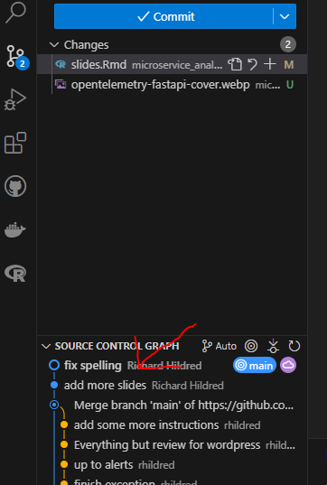
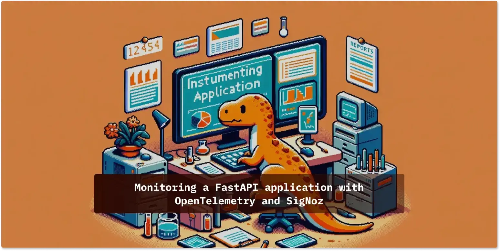

## Agenda

- Introduce the Challenge/Activity
- Theory to support learning outcomes and the Activity
- Initial demo of activity

## Microservice white box Challenge

- Create a codespace from this [github template](`r rmarkdown::metadata$lab`).
- follow the instructions in the README.md
- make sure to add metrics and a dashboard

## First things First

*I should have covered long ago*
```python
logger.info(f"{__name__} started")
```
This produces a log line, `main started`. Very important for preserving your sanity on what you are looking at.

## Then add the commit hash

- or other version information in the startup

```env
OTEL_RESOURCE_ATTRIBUTES=service.name=fastapiApp,service.version=<commit hash>
```

- saves sanity when degugging

## Get the commit hash by right clicking



## Please follow this article to practice with analysis

[](https://signoz.io/blog/opentelemetry-fastapi/)

## Look for

- Clicking on a trendline in the metric view to go to trace or log
- adding a metric per the last lab and creating a dashboard to see it

## I changed my view a bit

- I needed to develop a Microservice framework for another course
- Last week, I was thinking of a Microservice as a function
- this week I am thinking of a Microservice as a collection of endpoints
- produced by an autonomous team

## This approach is supported

- by flask or fastapi in python
- hono in ts/js
- spark framework in Java
- Carter in dotnet

## On Infrastructure like

- AWS Lambda
- knative
- cloudflare functions
- Azure functions

## Next week

- We will start with Microservices