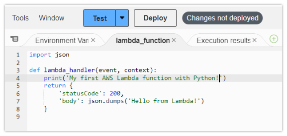

# Microservice (instrumenting)
---
## Agenda

- Introduce the Challenge/Activity
- Theory to support learning outcomes and the Activity
- Initial demo of activity
---
## Microservice white box Challenge

- Create a codespace from this [github template](https://github.com/rhildred/INFO8985_microservice_instrumentation
).
- follow the instructions in the README.md
---
## Learning Outcomes

- Support traces in a microservice by setting up custom spans so that code traces are available for troubleshooting.
- Measure REDS metrics in a microservice by adding and incrementing the appropriate counters.
- Integrate language logs by centralizing as open telemetry loggers.
---
## Micro services

- separate deployable
- meant to be provided by an autonomous team
- this is a great way to get things done in parallel
- continuous integration and deployment
- internal and external apis are done this way
- scale to 0 when not being used to not incur billing
---
## Micro Service Platforms

- AWS Lambda
- Google Cloud Functions
- Azure Functions
- knative functions
- Cloudflare pages and functions or workers
- k3s on the edge

---
## AWS Lambda



---
## Google Cloud Functions

```python
import functions_framework

from markupsafe import escape

@functions_framework.http
def hello_http(request):
    name = "World"
    return f"Hello {escape(name)}!" # escape as could be from request

```
---
## Azure functions

- uses a func cli to scaffold and developer adds code to implement (and instrument)
- The generated function_app.py project file contains your functions.
- End-to-end development tools are available for all stages of the development cycle.
- Numerous programming languages are supported, and hosting alternatives are available.
---
## Example function_app.py

```python
import azure.functions as func
app = func.FunctionApp()
@app.function_name(name="HttpTrigger1")
@app.route(route="req")
def main(req: func.HttpRequest) -> str:
    user = req.params.get("user")
    return f"Hello, {user}!"
```

---
## Knative functions

- also uses a func cli to scaffold and developer adds code to implement (and instrument)
- adapter to run azure function on kubernetes ... Kubernetes-based Event Driven Autoscaling (KEDA)
- essentially anything that can be a docker image can be run in knative
- a little more boilerplate code than the previous examples
---
## Instrumenting

- instrumenting a python microservice is like instrumenting a flask app
- example from a couple of weeks ago is included in the lab so that you can start with working code
- I got a lot further during the break by using signoz
- made signoz work with kubernetes cluster in a codespace
---
## Always remember to re-raise Exceptions

```python
except ValueError as exc:
    ...
    raise
```

- otel and signoz handle exceptions as traces
- appear separately

---
## Signoz has good presentation of exceptions

```python
from opentelemetry import trace
span = trace.get_current_span()
except ValueError as exc:
    # Record the exception and update the span status.
    span.record_exception(exc)
    span.set_status(trace.Status(trace.StatusCode.ERROR, str(exc)))
    raise
```
---
## Separate logging from handling

```python
import traceback
import logging
logging.basicConfig(level=logging.INFO)
logger = logging.getLogger(__name__)
try:
    do_something_that_might_error()
except Exception as error:
    logger.debug(traceback.format_exc())
    raise
```
---
## Separate Metric from handling

```python
try:
    do_something_that_might_error()
except:
    error_counter.add(1, {"error.module": __name__})
    raise
```
---
## In the next few weeks

- complete instrumentation of python function
- look in depth at analysis with signoz
- get metrics, log, trace and exceptions from javascript micro-frontends
- instrument and analyze a complete open source app for distributed tracing

