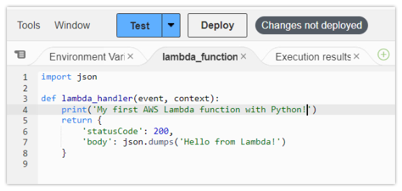

## Agenda

... Going to seem a lot like the flask app

- Introduce the Challenge/Activity
- Theory to support learning outcomes and the Activity
- Initial demo of activity

## Monolithic white box Challenge

- Create a codespace from this [github template](`r rmarkdown::metadata$lab`).
- follow the instructions in the README.md

## Learning Outcomes

- Support traces in a microservice by setting up custom spans so that code traces are available for troubleshooting.
- Measure REDS metrics in a microservice by adding and incrementing the appropriate counters.
- Integrate language logs by centralizing as open telemetry loggers.

## Micro Services

- AWS Lambda
- Google Cloud Functions
- Azure Functions
- Cloudflare pages and functions or workers

## AWS Lambda



## Google Cloud Functions

```python
import functions_framework

from markupsafe import escape

@functions_framework.http
def hello_http(request):
    name = "World"
    return f"Hello {escape(name)}!" # escape as could be from request

```

## Azure/Knative Functions

- both use a `func` cli with somewhat different parameters and output
- there is also a `kn` cli for knative
- `kn` cli makes services from a regular docker image/ Dockerfile

