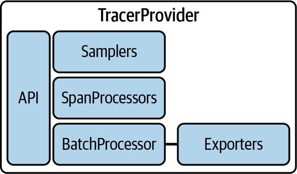

## Agenda

- Review database lab
- Introduce the Challenge/Activity
- Theory to support learning outcomes and the Activity
- Initial demo of activity

Chapter 3 and 5 in the book

## Otel Collector for Database (R)

```yaml
    queries:
      - sql: "SELECT sum(xact_commit+xact_rollback) as count_test FROM pg_stat_database; "
        metrics:
          - metric_name: query_requests # R from REDS
            value_column: count_test
```

## Otel Collector for Database (E)

```yaml
      - sql: "SELECT sum(xact_rollback) as count_test FROM pg_stat_database; "
        metrics:
          - metric_name: query_errors # E from REDS
            value_column: count_test
```

## Monolithic white box Challenge

- Create a codespace from this [github template](`r rmarkdown::metadata$lab`).
- Start with, "Create and launch an HTTP Server," in [the open telemetry python docs](https://opentelemetry.io/docs/languages/python/getting-started/)
- When you are done submit the output from the `docker-compose up` window

## Learning Outcomes

- Support traces in a monolithic app by instrumenting so that code traces are available for troubleshooting.
- Measure REDS metrics in monolithic app by adding and incrementing the appropriate counters.
- Integrate language logs by turning them into open telemetry loggers.

## Observability Pipelines

> push data from a process to an instance of the OpenTelemetry Collector. Filtering, batching, and creating metric views are all accomplished at the Collector rather than in the process itself.

- having said that the semantics of what we push are important
- chapter 3 covers this in some depth

## Pipeline Semantics

- signals are logs, traces and metrics
- add new signals like sessions in the Future
- signals have attributes

## Attributes (from the sqlquery)

```yaml
      - sql: "SELECT sum(xact_rollback) as count_test FROM pg_stat_database; "
        metrics:
          - metric_name: query_errors # E from REDS
            value_column: count_test
```

- the value_column is count_test but other columns will be stored as attributes

## Attributes (from today's lab)

```python
# Now create a counter
roll_counter = meter.create_counter(
    "dice.rolls",
    description="The number of rolls by roll value",
)
roll_counter.add(1, {"roll.value": result})
```

- roll.value is an attribute

## Future of Open Telemetry


## Foundation of OpenTelemetry is built on two points: 

- standards-based context and conventions, 
- alongside a universal data format.
- the telemetry pipeline includes attributes that meet stakeholder needs for observability

## Telemetry Schemas


## Open Telemetry Collector

- can provide schema transformations
- support changes in semantic conventions (and their associated support in analysis tools) 
- without having to reinstrument or redefine output from existing services

## setting up OpenTelemetry is twofold

- installing the software development kit (SDK)
- for python we do this with pip packages
- installing instrumentation
- some instrumentation is automatic with the SDK, some is custom

## requirements.txt

```txt
opentelemetry-distro
opentelemetry-exporter-otlp
```

- then run `opentelemetry-bootstrap -a install`

## logs

```python
import logging
logging.basicConfig(level=logging.INFO)
logger = logging.getLogger(__name__)
logger.warn("{} is rolling the dice: {}", "Rich", "6")
```

- built in to python

## Logger Provider


## custom traces

```python
from opentelemetry import trace

# Acquire a tracer
tracer = trace.get_tracer("diceroller.tracer")
with tracer.start_as_current_span("roll") as rollspan:
    rollspan.set_attribute("roll.value", 6) 
```

## Tracer Provider



## custom metrics

```python
from opentelemetry import metrics
meter = metrics.get_meter("diceroller.meter")
# Now create a counter
roll_counter = meter.create_counter(
    "dice.rolls",
    description="The number of rolls by roll value",
)
roll_counter.add(1, {"roll.value": "6"})
```

## Meter Provider


## Conclusion

- work required to reinstrument a large system a form of vendor lock-in
- advantage of OpenTelemetry is that once it’s done
- OpenTelemetry is a standard that works with every observability system.