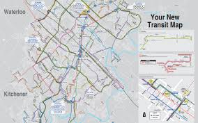

### Agenda

- Introduce the Challenge/Activity
- Theory to support learning outcomes and the Activity
- Initial demo of activity

#### The Challenge

Create a codespace from the [github template](https://github.com/rhildred/info8985-observability) and run:

```
ansible-playbook toaster.yml
```

Observe the running system and use the umlet vscode plugin to document it with a deployment diagram. Submit the deployment diagram with the uploader at the [end of the presentation](#Upload).

### Unit Learning Objectives

- Explain the advantages tracing has over plain logging for root cause analysis of an issue.
- Consider metrics like utilization, saturation and errors for system health.
- Give reasons for REDS/Google golden metrics being an improvement for understanding how happy users will be with a system.
- Consider logs, log levels and log models as a way of understanding software issues.

Note: See chapter 1 and 2 from the text

### Consider the bus
Who came by bus today?


### Bus observers
## Do they all observe the same things?
- riders
- municipality
- the garage
- drivers
- staffing coordinators
