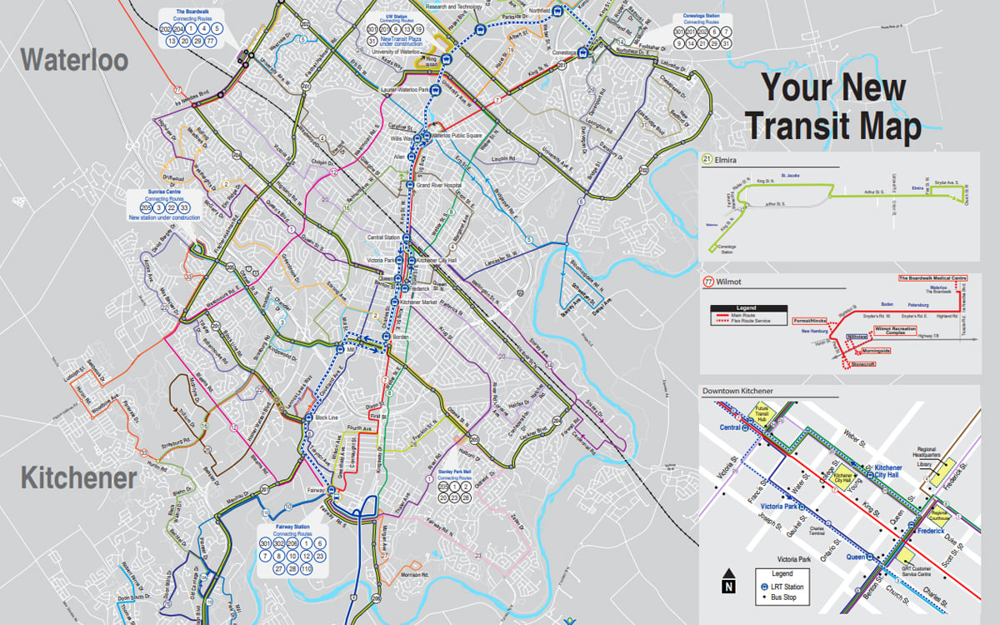
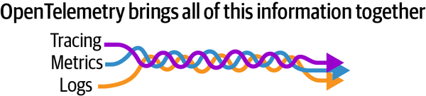

## Agenda

- Introduce the Challenge/Activity
- Theory to support learning outcomes and the Activity
- Initial demo of activity

Note: See chapter 1 and 2 from the text

## The Challenge

Create a codespace from the [github template](https://github.com/rhildred/info8985-observability) and run:

```
ansible-playbook toaster.yml
```

Observe the running system and use the umlet vscode plugin to document it with a deployment diagram. Submit the deployment diagram with the uploader at the [end of the presentation](#Upload).

## Unit Learning Objectives

- Explain the advantages tracing has over plain logging for root cause analysis of an issue.
- Consider metrics like utilization, saturation and errors for system health.
- Give reasons for REDS/Google golden metrics being an improvement for understanding how happy users will be with a system.
- Consider logs, log levels and log models as a way of understanding software issues.

## Who came by bus today?



## Bus Stakeholders
### Do they all care about observing the same things?

- riders
- municipality
- the garage
- drivers
- staffing coordinators

Complete observability integrates the needs of all Stakeholders

## Riders (users of the system)
- care about the current location of the bus they wish to get on
- a metric with attributes of bus: 1234, route: 201, lat: 43.48171410601913, long: -80.51813393653605 timestamp: 1725052424
- the eta of the bus at their location
- projection from a time series of the last 4 stops and the time it took last time

## Municipality
- care about which buses riders take, how many transfers, what time of day, how many riders are on each bus at any time and place
- tracing a rider from when they get on their first bus to when they get off their last
- a metric with attributes of bus: 1234, route: 201, lat: 43.48171410601913, long: -80.51813393653605 timestamp: 1725052424, riders: 42

## Garage
- care about problem logs for the particular bus that they have in front of them
- need sensor data for other things like predictive maintenance
- this could also be from logs on the bus or from metrics reported directly by sensors
- metrics would allow them to get the bus in for predictive maintenance

## Drivers
- care about their own schedules
- a customized report produced from the database for them
- care about the scheduled arrival times at each stop
- could add another difference from schedule attribute to the stop arrival metric in the previous slide with an alert when the metric is greater than 90 seconds in either direction

## Staffing Coordinators

- rely on logs to know any problems with the bus
- care about ridership metrics somewhat for the rare occasions they could schedule an extra bus
- care about stop arrival metrics that also include whether the drivers are early or late at stops

## Different Observers Have Different Interests



## Tracing
- bus example traces a particular rider spanning their entire trip.
- the advantage of tracing is that it provides observability of an actor as they go through multiple services
- in contrast, logging is from the perspective of the system rather than the actor

## Metrics
- key performance indicators for the different stakeholders of the system
- in the bus example utilization would be riders
- saturation is the riders divided by capacity of the bus
- errors are drivers being 90 seconds or more early or late at stops

## REDS
Requests

Errors

Duration

Saturation

## REDS adds
- requests, for instance the number of riders that start trips
- duration, the time they spend on the bus system
- in the GRT we don't tap off so this one is tricky
- if we narrow focus to the ticket purchasing app see that errors, requests, and duration tell us something about our user experience

## Google Golden Signals
> The four golden signals of monitoring are latency, traffic, errors, and saturation. If you can only measure four metrics of your user-facing system, focus on these four.

### Latency
- The time it takes to service a request.

## Google Golden Signals (cont.)

### Traffic
- A measure of how much demand is being placed on your system.

### Errors
- The rate of requests that fail.

### Saturation
- How "full" your service is.

## Logs


