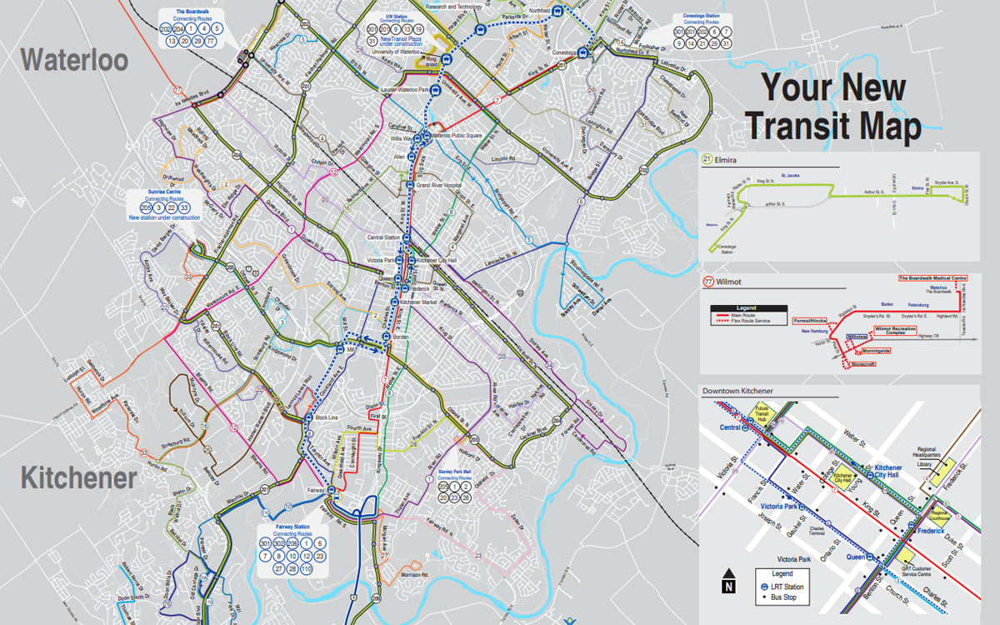
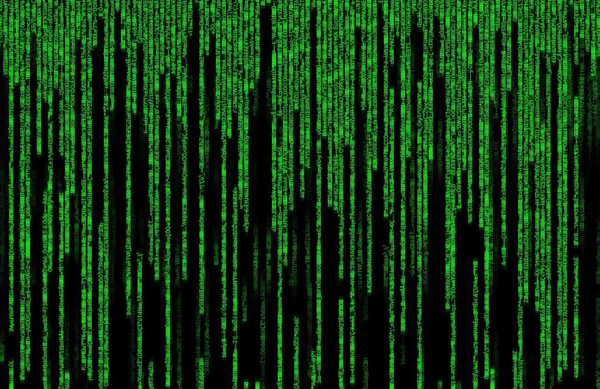

# Observability
different stakeholders observe different things

---

## Agenda

- Introduce In class task 1
- Theory to support learning outcomes and the Activity
- Initial demo of activity

Note: See chapter 1 and 2 [from the text](https://learning.oreilly.com/library/view/learning-opentelemetry/9781098147174/).

---

## In Class Task 1

Create a codespace from the [github template](https://github.com/conestogac-acsit/cdevops-info8985-task1) and set it up so that when you run:

```
docker compose up -d
```
signoz comes up, monitoring your docker infrastructure. You will want to use [this repository](https://github.com/conestogac-acsit/cdevops-signoz) as a submodule.

Observe the running system and in week 2 use [mermaid](https://mermaid.js.org/syntax/c4.html#c4-deployment-diagram-c4deployment) to document it with a deployment diagram. Make the deployment diagram part of your `README.md`.

---

## Unit Learning Objectives

- Explain the advantages tracing has over plain logging for root cause analysis of an issue.
- Consider metrics like utilization, saturation and errors for system health.
- Give reasons for REDS/Google golden metrics being an improvement for understanding how happy users will be with a system.
- Consider logs, log levels and log models as a way of understanding software issues.

---

## Who came by bus today?



---

## Bus Stakeholders
### Do they all care about observing the same things?

- riders
- municipality
- the garage
- drivers
- staffing coordinators

Complete observability integrates the needs of all Stakeholders

---

## Riders (users of the system)
- care about the current location of the bus they wish to get on
- a metric with attributes of bus: 1234, route: 201, lat: 43.48171410601913, long: -80.51813393653605 timestamp: 1725052424
- the eta of the bus at their location
- projection from a time series of the last 4 stops and the time it took last time

---

## Municipality
- care about which buses riders take, how many transfers, what time of day, how many riders are on each bus at any time and place
- tracing a rider from when they get on their first bus to when they get off their last
- a metric with attributes of bus: 1234, route: 201, lat: 43.48171410601913, long: -80.51813393653605 timestamp: 1725052424, riders: 42

---

## Garage
- care about problem logs for the particular bus that they have in front of them
- need sensor data for other things like predictive maintenance
- this could also be from logs on the bus or from metrics reported directly by sensors
- metrics would allow them to get the bus in for predictive maintenance

---

## Drivers
- care about their own schedules
- a customized report produced from the database for them
- care about the scheduled arrival times at each stop
- could add another difference from schedule attribute to the stop arrival metric in the previous slide with an alert when the metric is greater than 90 seconds in either direction

---

## Staffing Coordinators

- rely on logs to know any problems with the bus
- care about ridership metrics somewhat for the rare occasions they could schedule an extra bus
- care about stop arrival metrics that also include whether the drivers are early or late at stops

---

## Different Observers Have Different Interests


---

## Tracing
- bus example traces a particular rider spanning their entire trip.
- the advantage of tracing is that it provides observability of an actor as they go through multiple services
- in contrast, logging is from the perspective of the system rather than the actor

---

## Metrics
- key performance indicators for the different stakeholders of the system
- in the bus example utilization would be riders
- saturation is the riders divided by capacity of the bus
- errors are drivers being 90 seconds or more early or late at stops

---

## REDS
Requests

Errors

Duration

Saturation

---

## REDS adds
- requests, for instance the number of riders that start trips
- duration, the time they spend on the bus system
- in the GRT we don't tap off so this one is tricky
- if we narrow focus to the ticket purchasing app see that errors, requests, and duration tell us something about our user experience

---

## Google Golden Signals
> The four golden signals of monitoring are latency, traffic, errors, and saturation. If you can only measure four metrics of your user-facing system, focus on these four.

### Latency
- The time it takes to service a request.

--- 
## Google Golden Signals (cont.)

### Traffic
- A measure of how much demand is being placed on your system.

### Errors
- The rate of requests that fail.

### Saturation
- How "full" your service is.

---

## Logs



---

## Logs ... topic by themselves
- text-based messages meant for human consumption that describe the state of a system or service
- for instance, that a file couldn’t be written because the storage device was out of space
- full observability, by contrast, track available storage capacity
- leading indicators to prevent a failure that can be logged

---

## Log levels
Level|What it means / When to use it
--|--
logging.NOTSET|When set on a logger, indicates that ancestor loggers are to be consulted to determine the effective level. If that still resolves to NOTSET, then all events are logged. When set on a handler, all events are handled.
logging.DEBUG|Detailed information, typically only of interest to a developer trying to diagnose a problem.
logging.INFO|Confirmation that things are working as expected.

---

## Log levels (cont)
Level|What it means / When to use it
--|--
logging.WARNING|An indication that something unexpected happened, or that a problem might occur in the near future (e.g. ‘disk space low’). The software is still working as expected.
logging.ERROR|Due to a more serious problem, the software has not been able to perform some function.
logging.CRITICAL|A serious error, indicating that the program itself may be unable to continue running.

---

## Log models
models semi structure the data in the logs

```python
import logging

logging.basicConfig(format='%(asctime)s %(clientip)-15s %(user)-8s %(message)s')
logger = logging.getLogger('tcpserver')
logger.warning('Protocol problem: %s', 'connection reset', extra={'clientip': '192.168.0.1', 'user': 'fbloggs'})
```

---

## Something went wrong
> Our engineers have been notified and are working on the problem

- observability, yes (if the devops engineers actually have been notified)
- messages like this are shown to users in the case of unhandled exceptions

---

## Please don't
... make an exception observable and then swallow it

- exception handling is different then making the exception observable
- always re-throw the exception at the point of writing a metric or logging

---

## Observability
- observability is in the process of changing for the better
- the heart of that change will be a newfound ability to correlate across all forms of telemetry: traces, metrics, logs
- correlation is the key to unlocking the workflows and automation that we desperately need to keep up with this world of ever expanding complex systems.

---

## Why Signoz?
- built for open telemetry
- includes infrastructure, logs, traces and dashboards for metrics
- lots of other tools like Prometheus and Grafana
- datadog

---

## Different on purpose
- most telemetry uses cloud storage
- the way we are setting signoz up with docker will run on most NAS devices

---

## TrueNas for instance


---

## A NAS has 2 NICs

- one NIC can have internet access for a cloudflare tunnel
- one NIC can be on a private network with no access to the internet
- IOT devices can be on that network
- observable but not vulnerable

---

## In class task 1
- over the next 2 weeks you will work on In class task 1
- this week get repository started with submodule
- next week more theory and document with README.md and mermaid.
