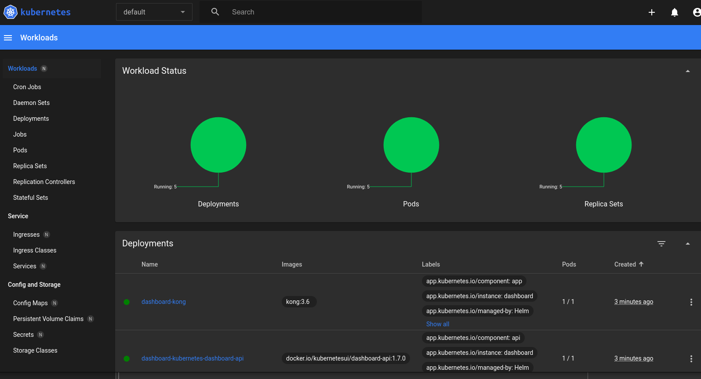
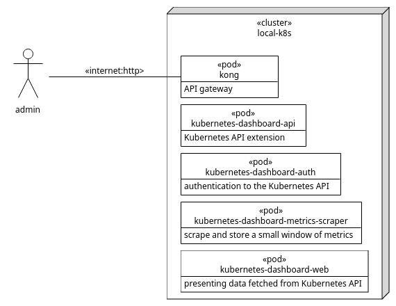
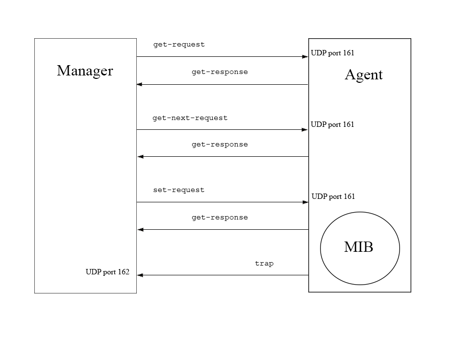
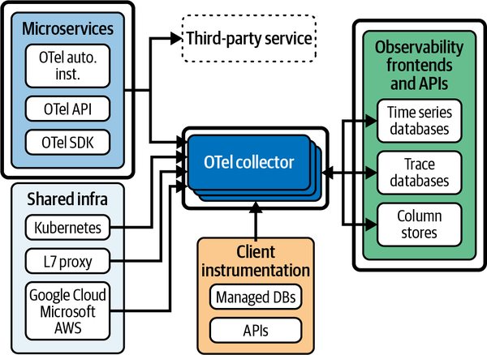
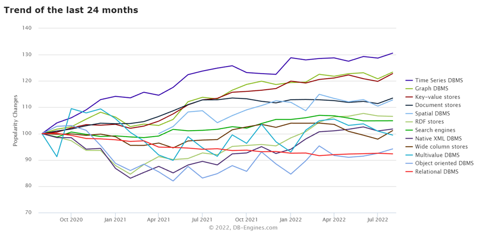
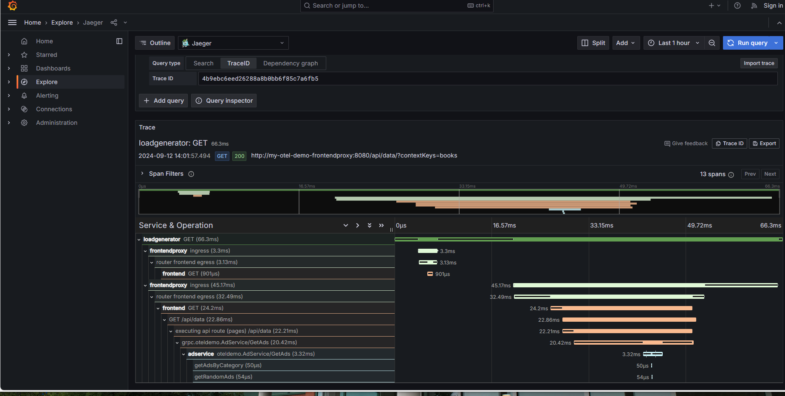

## Agenda

- Review observability Challenge/Activity
- Introduce the Challenge/Activity for telemetry
- Theory to support telemetry learning outcomes and activity
- Initial demo of activity


Note: See chapter 3 and 4 from the text

## Observability (activity review)

We installed the kubernetes dashboard. From their github:

> Kubernetes Dashboard is a general purpose, web-based UI for Kubernetes clusters. It allows users to manage applications running in the cluster and troubleshoot them, as well as manage the cluster itself.

- essentially this was a "hello world" for a distributed system using kubernetes ansible and helm
- a pod is the unit of deployment in our case ... see the next slides

## Kubernetes dashboard



## Deployment diagram



## Telemetry Lab

Create a codespace from the [github template](`r rmarkdown::metadata$lab`) and run:

```
pip install -r requirements.txt
ansible-playbook playbook.yml
kubectl port-forward svc/my-otel-demo-frontendproxy 8080:8080
```

Follow instructions in chapter 4 of the text and make notes in README.md. Submit the README.md file with the uploader at the [end of the presentation](#Upload).

## Learning outcomes

- Explain how historical applications of telemetry for things like predictive maintenance apply to software.
- Compare alternatives for software telemetry within the observability ecosystem.
- Justify the storage needs for telemetry, based on information needs for operational success. 
- Validate and configure collectors to collect logs and/or metrics for observability and troubleshooting.


## A Brief History of Telemetry

.jpg)

## "Telemetry" sent over telegraph lines

- used to control switches on train tracks, power plants and public power grids

> early but important distributed systems!

- moved onto trains to prevent bearing overheating and fires
- further expanded to predictive maintenance to keep broken trains from blocking the tracks
- logging esentially built into Unix software with system activity reporting and system logging service

## computer telemetry on network

- first logs ... to tell you about individual events and moments within a system
- metrics ... to see how system performance changes over time
- then tracing ... look at entire operations and how they combined to form transactions

## Supervisory Control And Data Acquisition (SCADA)

.jpg)

## Uses

- Industrial include manufacturing, process control, power generation, fabrication, and refining
- Infrastructure ... include water treatment and distribution, wastewater collection and treatment, oil and gas pipelines, electric power transmission, and wind farms.
- Facility , including buildings, airports, ships, and space stations ... monitor and control heating, ventilation, and air conditioning systems (HVAC), access, and energy consumption.

## Critical Infrastructure

- Many minor changes over 10 year system lifespan
- changes driven by adding new equipment, regulatory requirements, functionality improvements
- Despite in-depth testing before introduction to production environment ... Difficult to test all consequence of change
- Pretty major failures to important infrastructure ... Sounds like a case for DevOps

## Simple Network Management Protocol (SNMP)



## SNMP consists of three key components

- Managed devices
- Agent - software that runs on managed devices
- Network management station (NMS) - software that runs on the manager

### Uses

- SNMP used by IT to monitor and update networked devices
- SCADA used by operations to control processes

## Open Telemetry



## Open Telemetry by contrast

- used to monitor distributed software systems 
- similar to SCADA and SNMP in that it monitors and generates alerts
- different in that it is read only, where SCADA and SNMP can also manipulate systems
- tracing, look at entire operations as they span services
- absence of auditable tracking in SCADA ... opportunity for DevOps??????

## Time Series Database (TSDB) Storage



## Store enough to meet stakeholder needs

- in today's demo timeseries data will be stored in memory
- a long term storage option is Thanos

> Thanos provides a global query view, high availability, data backup with historical, cheap data access as its core features in a single binary.

- Thanos supports S3, GCS, Azure, OpenStack Swift, Tencent COS, AliYun OSS, Baidu BOS, Oracle Cloud Infrastructure Object Storage object stores
- storage format is object based with a block defined by a prefix and a series of blobs

## Storage Configuration

- focusing on Thanos, there is [documentation here](https://thanos.io/tip/thanos/storage.md/).
- the storage is controlled by the values.yaml file in the [helm chart](https://github.com/bitnami/charts/blob/main/bitnami/thanos/values.yaml)
- in open telemetry demo for today's lab the [helm chart is here](https://github.com/open-telemetry/opentelemetry-helm-charts/blob/main/charts/opentelemetry-demo/values.yaml).
- there is a lot to these values, but focus on the components (starting on line 47)

## Otel collectors
- each component has an otel collector to make it observable
- for instance the emailService has:
```
      - name: OTEL_EXPORTER_OTLP_TRACES_ENDPOINT
        value: http://$(OTEL_COLLECTOR_NAME):4318/v1/traces
```
- many more examples to follow when we talk about instrumenting

## Telemetry Example (Trace)



## Manual testing for observability

- the [lab](`r rmarkdown::metadata$lab`) uses feature flags, described in chapter 4, to manipulate the open telemetry demo
- note your observations in the README file and submit it [below](#Upload)

## Observability Coverage


## Telemetry

> Without telemetry, your system is just a big black box filled with mystery.

- this is especially a problem with distributed systems
- part of the system runs on a sensor, appliance or even a phone
- telemetry lets operators and other stakeholders see inside the box and help the system reach it's goals.

