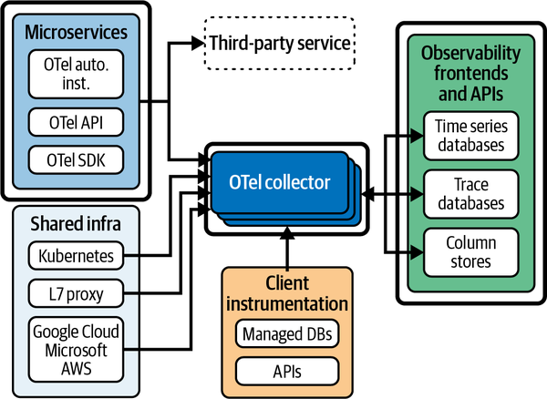
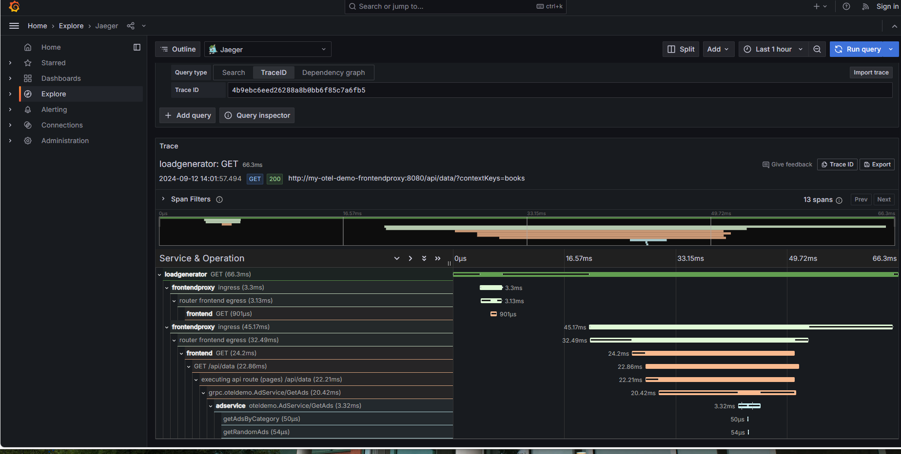

# Telemetry
and storage configuration

---

## Agenda

- Review progress and remaining work on in class Task 1
- Theory to support telemetry learning outcomes and activity
- Demo for finishing in class task 1

Note: See chapter 3 and 4 from the text

---


## Learning outcomes

- Explain how historical applications of telemetry for things like predictive maintenance apply to software.
- Compare alternatives for software telemetry within the observability ecosystem.
- Justify the storage needs for telemetry, based on information needs for operational success. 
- Validate and configure collectors to collect logs and/or metrics for observability and troubleshooting.

---

## A Brief History of Telemetry

.jpg)

---

## "Telemetry" sent over telegraph lines

- used to control switches on train tracks, power plants and public power grids

> early but important distributed systems!

- moved onto trains to prevent bearing overheating and fires
- further expanded to predictive maintenance to keep broken trains from blocking the tracks
- logging esentially built into Unix software with system activity reporting and system logging service

---

## computer telemetry on network

- first logs ... to tell you about individual events and moments within a system
- metrics ... to see how system performance changes over time
- then tracing ... look at entire operations and how they combined to form transactions

---

## Supervisory Control And Data Acquisition (SCADA)

.jpg)

---

## Uses

- Industrial include manufacturing, process control, power generation, fabrication, and refining
- Infrastructure ... include water treatment and distribution, wastewater collection and treatment, oil and gas pipelines, electric power transmission, and wind farms.
- Facility , including buildings, airports, ships, and space stations ... monitor and control heating, ventilation, and air conditioning systems (HVAC), access, and energy consumption.

---

## Critical Infrastructure

- Many minor changes over 10 year system lifespan
- changes driven by adding new equipment, regulatory requirements, functionality improvements
- Despite in-depth testing before introduction to production environment ... Difficult to test all consequence of change
- Pretty major failures to important infrastructure ... Sounds like a case for DevOps

---

## Simple Network Management Protocol (SNMP)


---

## SNMP consists of three key components

- Managed devices
- Agent - software that runs on managed devices
- Network management station (NMS) - software that runs on the manager

---

### Uses

- SNMP used by IT to monitor and update networked devices
- SCADA used by operations to control processes

---

## Open Telemetry



---

## Open Telemetry by contrast

- used to monitor distributed software systems 
- similar to SCADA and SNMP in that it monitors and generates alerts
- different in that it is read only, where SCADA and SNMP can also manipulate systems
- tracing, look at entire operations as they span services
- absence of auditable tracking in SCADA ... opportunity for DevOps??????

---

## Time Series Database (TSDB) Storage


---

## Store enough to meet stakeholder needs

- Signoz uses clickhouse as a time series database
- Use Clickhouse and NAS features for long term storage 

For Instance

Tiered Storage Capabilities:
> ClickHouse supports tiered storage, allowing you to implement strategies like keeping recent, high-granularity data readily accessible while automatically rolling up or moving older data to more cost-effective storage tiers (e.g., object storage like Amazon S3) for long-term retention.

---

## Storage Configuration

- for testing we are using standard clickhouse
- there is documentation on using clickhouse with [separate storage and compute](https://clickhouse.com/docs/guides/separation-storage-compute)
- note that a NAS like truenas supports creating S3 storage
- possibly on spinning disks rather than SSD

---

## clickhouse Time-to-Live (TTL):
> TTL is a crucial feature for managing data retention. It allows for automatic expiration and deletion of older data based on defined time intervals, ensuring optimal storage utilization and compliance with data retention policies. This is particularly valuable for long-term storage scenarios where older data might have different retention requirements or can be aggregated.


---

## Otel collectors
- otel collectors make services observable
- signoz has an otel collector container in its base configuration
- we make a 2nd otel collector in the docker folder
- we have observability of logs and hostmetrics
- `docker/otel-collector-config.yaml` also has a receiver for otlp over http that is used in task 5 and the final project to get telemetry from the browser
- in task 2 we will add another otel collector for the database
---

## Telemetry Example (Trace)



---

## Telemetry

> Without telemetry, your system is just a big black box filled with mystery.

- this is especially a problem with distributed systems
- part of the system runs on a sensor, appliance or even a phone
- telemetry lets operators and other stakeholders see inside the box and help the system reach it's goals.

---

## Mermaid diagrams for deployment

- there is a sample in the README.md

```
    C4Deployment
    title Deployment Diagram for signoz monitoring docker

    Deployment_Node(codespace, "codespace on Azure", "ideal-space-cod-xpx7579j63vq7r.github.dev"){

        Deployment_Node(docker, "Docker", "docker in docker"){
            Container(start, "assignment to fill in containers")
        }
    }

```

---

## Looks like


---

## Remaining work is to

```
Container(start, "assignment to fill in containers")
```

- make one of these for each container
- write a paragraph or points about the details of that container in the rest of the README.
- don't forget to end with a concluding paragraph
- commit and push your work
- download a .zip from github
- submit the .zip and put a link to your github in the comments